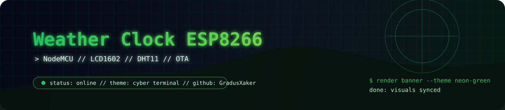

<div align="center">
  

  <h1>weather-clock-esp8266-ru</h1>
  <p><strong>Домашняя погодная консоль в кибер-стиле.</strong> Часы, погода и OTA-настройка на `ESP8266`, `LCD1602 I2C` и `DHT11`.</p>

  <p>
    
    
    
    
  </p>
</div>

```text
> host: weather-clock
> input: lcd + dht11 + wifi
> output: local clock + internet weather + ota updates
```

## обзор

Проект превращает `NodeMCU v3` в автономные часы с погодой: локальный дисплей, веб-настройка с телефона, автоопределение дисплея и обновление по сети без постоянного USB.

## Быстрый старт за 5 минут

1. Подключите LCD1602 I2C и DHT11 по таблице ниже.
2. Установите библиотеки из раздела 2.
3. Загрузите `weather-clock-esp8266.ino` в NodeMCU v3.
4. Подключитесь с телефона к `ClockSetup`, откройте `192.168.4.1`.
5. Сохраните Wi-Fi, город `Novosibirsk`, UTC `7`.

## 1) Подключение по пинам

### NodeMCU v3 (ESP8266 CH340, Type-C)

| Устройство | Контакт | NodeMCU |
|---|---|---|
| LCD1602 I2C | SDA | D2 (GPIO4) |
| LCD1602 I2C | SCL | D1 (GPIO5) |
| LCD1602 I2C | VCC | 3.3V |
| LCD1602 I2C | GND | GND |
| DHT11 модуль | DATA | D5 (GPIO14) |
| DHT11 модуль | VCC | 3.3V |
| DHT11 модуль | GND | GND |

Важно:
- Адрес I2C ищется автоматически (`0x27`, `0x3F`, затем сканирование шины).
- Для DHT11-модуля отдельная подтяжка обычно уже есть на плате.

## 2) Библиотеки Arduino IDE

### Установка поддержки ESP8266 (обязательно)

1. Откройте в Arduino IDE: `Файл -> Настройки`.
2. В поле `Additional boards manager URLs` добавьте ссылку:

   `http://arduino.esp8266.com/stable/package_esp8266com_index.json`

3. Откройте: `Инструменты -> Плата -> Менеджер плат`.
4. Найдите и установите пакет: `ESP8266 by ESP8266 Community`.
5. Выберите плату: `Инструменты -> Плата -> NodeMCU 1.0 (ESP-12E Module)`.

Если этого не сделать, возможна ошибка компиляции:
`ESP8266HTTPClient.h: No such file or directory`

Установите через Library Manager:
- `DHT sensor library` (Adafruit)
- `LiquidCrystal I2C`
- `ArduinoJson` (6.x)
- `NTPClient`

Встроенные для ESP8266 используются автоматически:
- `ESP8266WiFi`, `ESP8266WebServer`, `DNSServer`, `LittleFS`, `ESP8266HTTPClient`, `ArduinoOTA`

## 3) Погода без API ключа

- Погода берется автоматически из интернет-сервиса `wttr.in`.
- API key не требуется.
- Город по умолчанию: `Novosibirsk`.
- Часовой пояс по умолчанию: `UTC+7`.

## 4) Загрузка прошивки

1. Откройте файл `weather-clock-esp8266.ino` в Arduino IDE.
2. Выберите плату: **NodeMCU 1.0 (ESP-12E Module)**.
3. Выберите порт COM вашей платы.
4. Загрузите скетч.

## 5) Первичная настройка с телефона

Если устройство не знает Wi-Fi:
- ESP поднимет точку доступа: `ClockSetup`
- Подключитесь к ней с телефона.
- Откройте: `http://192.168.4.1`
- Введите:
  - SSID
  - пароль Wi-Fi
  - город (например `Novosibirsk`)
  - UTC offset (для Новосибирска `7`)
- Нажмите **Сохранить**.
- Устройство перезагрузится и подключится к роутеру.

## 6) Веб-страницы устройства

- `/` — страница настройки
- `/status` — JSON-статус (Wi-Fi, DHT11, погода, последняя ошибка API)

## 7) OTA-обновление по Wi-Fi

После подключения устройства к домашнему Wi-Fi доступна прошивка по сети через Arduino OTA.

Как использовать:
1. Откройте Arduino IDE в той же локальной сети.
2. Выберите сетевой порт вида `clock-nsk-xxxxxx at ...`.
3. Нажмите загрузку скетча — прошивка обновится без USB.

Имя OTA-хоста видно в `/status` в поле `otaHostname`.

## 8) Сброс настроек кнопкой

- Используется кнопка **FLASH** на NodeMCU (GPIO0 / D3).
- После старта подождите 10 секунд.
- Нажмите и удерживайте кнопку FLASH 6 секунд.
- Конфигурация (`Wi-Fi`, город, UTC) будет удалена, устройство перезагрузится и снова поднимет `ClockSetup`.

## 9) Что показывается на LCD1602

Цикл экранов:
1. Дата и время (с секундами)
2. DHT11: температура и влажность
3. Погода из интернета: уличная температура и код погодного состояния

## 10) Настраиваемые параметры в коде

В начале скетча можно изменить:
- интервалы обновления экранов и датчиков
- параметры AP (`ClockSetup`)
- параметры Wi-Fi reconnect (экспоненциальная пауза)

## 11) Диагностика

- Откройте Serial Monitor на `115200` baud.
- Если нет данных погоды:
  - проверьте написание города
  - проверьте доступ ESP к интернету
  - проверьте поле `weatherLastError` в `/status`
- Если дисплей пустой:
  - проверьте питание и GND
  - проверьте SDA/SCL
  - попробуйте другой I2C адрес
- Если OTA не видно в IDE:
  - убедитесь, что ПК и ESP в одной сети
  - проверьте, что `wifiConnected=true` и `otaEnabled=true` в `/status`
